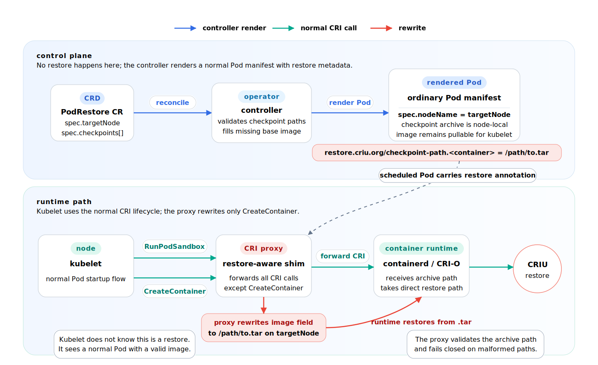

# Restoring a Pod from a checkpoint

The operator can restore a checkpointed container as an ordinary Pod, using the
container runtime's **direct `.tar` restore path** (skipping the slow conversion
of the checkpoint into an OCI image). This is implemented with two pieces:

1. A **`PodRestore` custom resource** and its controller (in the operator).
2. A per-node **CRI proxy** host service that performs the actual image rewrite.

## How it works



The kubelet drives its normal sequence: `RunPodSandbox`, then
`CreateContainer`, then `StartContainer`. It never knows a restore is happening.
The CRI proxy is the only component that does: it forwards every CRI call
unchanged **except** `CreateContainer`, where, if the Pod sandbox carries
`restore.criu.org/checkpoint-path.<container>` for the container being created,
it rewrites that container's image to the local `.tar` path so the runtime takes
its CRIU restore path.

Because the rewrite happens entirely at the CRI layer, this works the same for
**containerd** and **CRI-O**.

## Using `PodRestore`

```yaml
apiVersion: criu.org/v1
kind: PodRestore
metadata:
  name: redis-restore
spec:
  targetNode: worker-1                 # node that holds the checkpoint .tar
  checkpoints:
    - container: redis
      path: /var/lib/kubelet/checkpoints/checkpoint-redis_default-redis-<ts>.tar
  template:                            # the restored workload
    spec:
      containers:
        - name: redis
          # image optional: derived from the checkpoint when omitted
```

The controller pins the source checkpoint (a `.keep` marker, see
[retention_policy.md](retention_policy.md)) so it is not garbage-collected during
the restore, and tracks progress in `status.phase`
(`Pending → Restoring → Running`/`Failed`).

Notes:

- A checkpoint is per **container**; only the containers listed in `checkpoints`
  are restored. Other containers in the template start normally.
- The image only satisfies the kubelet image-pull gate; it plays no role in the
  restore. Set it explicitly if the operator cannot read the archive to discover
  the base image itself.
- The checkpoint `.tar` must already exist on `targetNode`.

## Deploying the CRI proxy

Install the CRI proxy as a host service, then point kubelet at the proxy socket:

```sh
make build-cri-proxy
sudo deploy/cri-proxy/install-systemd.sh
curl -fsS http://127.0.0.1:18080/readyz
```

The installer copies the proxy to `/usr/local/bin/cri-proxy`, installs
`cri-restore-proxy.service`, installs `cri-restore-proxy.socket`, and installs a
kubelet drop-in so kubelet starts after systemd has created the proxy socket on
boot. The default upstream is containerd (`/run/containerd/containerd.sock`).
For CRI-O, set `CRI_PROXY_UPSTREAM=/run/crio/crio.sock` when running the
installer, or edit `/etc/default/cri-restore-proxy`.

For kubelet to use the proxy, set its runtime endpoint to the proxy socket and
restart it on each node:

```sh
--container-runtime-endpoint=unix:///run/cr-restore-proxy/cri-proxy.sock
--image-service-endpoint=unix:///run/cr-restore-proxy/cri-proxy.sock
```

The proxy sits in the critical kubelet-to-runtime path. Roll it out to a canary
node first. Running the proxy as a normal DaemonSet is useful for development,
but is not reboot-safe once kubelet is configured to depend on the proxy socket.
The systemd deployment uses socket activation, so the kubelet can connect to the
CRI socket even if the proxy process is still starting or has just restarted;
systemd starts the service and queues the connection until the proxy accepts it.

## Security

The proxy speaks to the runtime socket and the restore lets a Pod run from
arbitrary checkpoint state, so:

- Treat the proxy socket as sensitive as the runtime socket (it is created
  `0600`).
- Restrict who may create `PodRestore` resources (RBAC), since a restore runs a
  frozen process image as a Pod.
